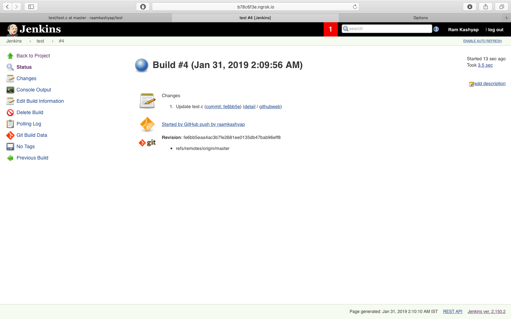
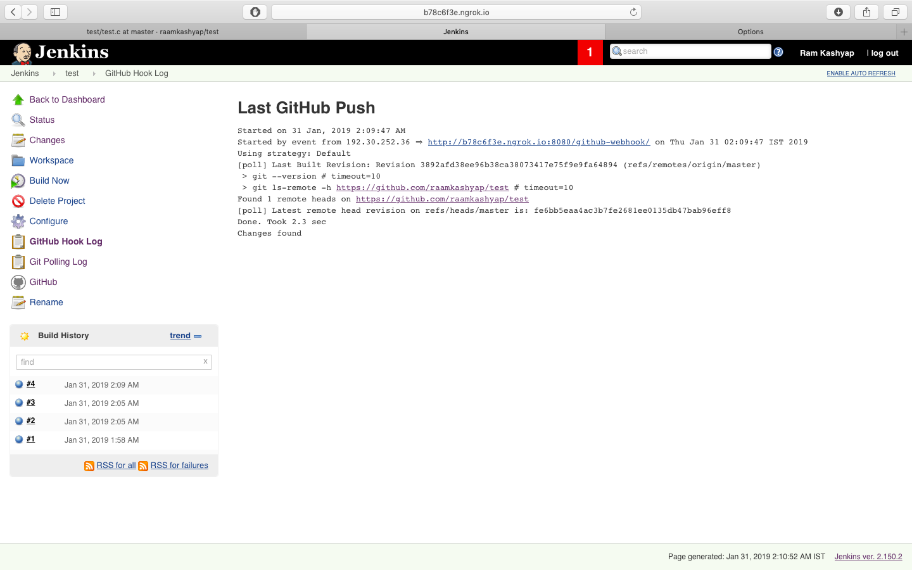
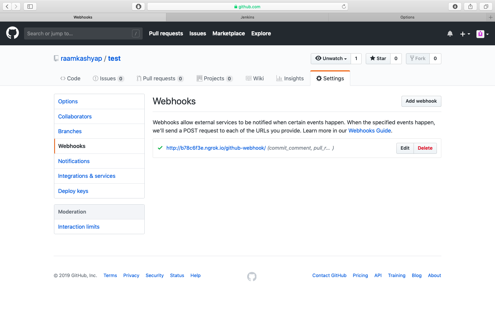
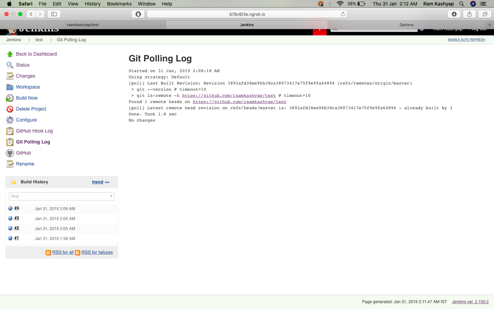

# jenkins-github Assignment
- Create a simple Job, and the build action of the job can be something simple like ```echo "Hello World!"```
- Connect the job to your GitHub Assignment repository using Git SCM Poll for every 5 seconds
- Whenever you commit to your repository, the Jenkins job should run automatically.

## Jenkins Assignment
-I created a job which runs test.c which prints hello world 
-I configured the job in such a way that if there are any changes it builds for every 5 mins and if there are no changes it sticks to the last build
-I webhooked the github with jenkins job so that whenever i pushed or get a pull request or commit it updates the build
-Here are the screenshots 





